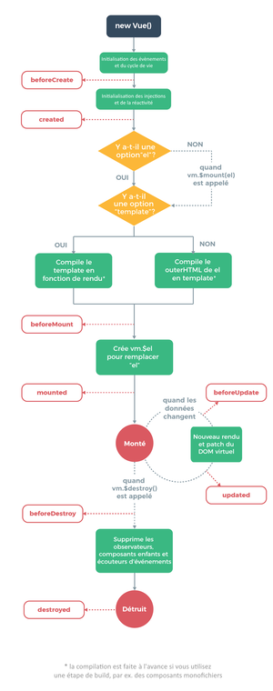

# Vue JS

## Instance de Vue

*   **Créer une instance de Vue :**

```
var vm = new Vue({
  // options
})
```

*   **Par convention on utilise la variable `vm` (abréviation pour ViewModel) pour faire référence à nos instances de Vue.**

## Données et méthodes

*   **Quand une instance de Vue est créée, cela ajoute toutes les propriétés dans son objet `data` au système réactif de Vue. Quand une valeur de ces propriétés change, la vue va alors changer, elle se met à jour pour concorder avec les nouvelles valeurs.**

```
// Notre objet de données :

var data = { a: 1}

// L'objet est ajouté à une instance de Vue :

var vm = new Vue({
  data: data
})
```

*   **Quand ces données changent, le rendu de la vue est refait. Les propriétés dans `data` sont réactives si elles existaient quand l'instance a été créée.**

*   **Si on as besoin d'une propriété plus tard qui n'a pas de valeur dès le début, on as juste besoin de la créer avec n'importe quelle valeur initiale.**

*   **Seule exception : `Object.freeze()` => empêche les propriétés existantes d'être changées, ce qui implique le système de réactivité ne peut pas traquer les changements.**

*   **En plus des propriétés de données, les instances de Vue exposent de nombreuses méthodes et propriétés utiles. Ces propriétés et méthode sont préfixées par `$` pour les différencier des propriétés proxifiées de data.**

*   **Chaque instance de vue traverse une série d'étapes d'initialisation au moment de sa création. Elle invoque des *hooks* de cycle de vie, qui permet de donner l'opportunité d'éxecuter une logique personnalisée à chaque niveau. Types de *hooks* :**

	+   **`created`, `mounted`, `updated` et `destroyed` => Tous ces hooks de cycle de vie sont appelés avec leur `this` pointant sur l'instance de la vue qui les appelle.**

*   **Résumé en photo :**



