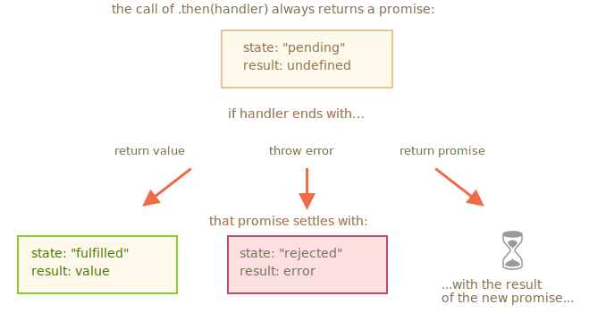

# Javascript :

## Variables :

[:question: :question:](variable.md)

- **Pour créer une variable en js => `let`**.
- **Ancienne version => `var`**.
- **Variable non changeante => `const`**.

## 7 Types de données :

[:question: :question:](typesDeDonnees.md)

- **number => pour les nombres de toute sorte: entier ou virgule flottante**.
- **string => pour les chaînes de caractères**.
- **boolean => pour `true` et `false`**.
- **null => pour les valeurs inconnues**.
- **undefined => pour les valeurs non attribuées**.
- **object => pour des structures de données plus complexes**.
- **symbol => d'identificateurs uniques**.
- **(typeof => permet de connaitre le type de contenu dans une variable)**.

## Conversion de types en JS :

[:question: :question:](conversionDeTypes.md)

Les trois conversions de types les plus utilisées sont chaîne, nombre et booléen.

- **String Conversion => `String(value)`**.
- **Numeric Conversion => `Number(value)`**.
- **Boolean Conversion => `Boolean(value)`**.

## Operateurs :

[:question: :question:](operateurs.md)

- **Un operand est ce à quoi les opérateurs sont appliqués.**

- **Un opérateur est unaire si il a un operand seule**.

- **Un opérateur est binaire si il a 2 operand**.

- **binary+ => concatener 2 chaînes**.

- **unary+ => convertit les chaînes en nombres**.

## Comparaisons :

[:question: :question:](comparaison.md)

- **Les opérateurs de comparaison renvoient une valeur logique.**
- **Les chaînes de caractères sont comparées lettre par lettre dans l'ordre "dictionnaire"**.
- **Lorsque des valeurs de différents types sont comparées, elles sont converties en nombres (à l'exclusion d'un contrôle d'égalité strict)**.
- **Les valeurs `null` et `undefined` sont égales `==` et ne correspondent à aucune autre valeur**.
- **Soyez prudent lorsqu'on utilse des comparaisons telle que > ou < avec des variables pouvant parfois être `null/undefined`. Faire une vérification séparée pour `null/undefined` est une bonne idée**.

## Interaction :

[:question: :question:](interaction.md)

- **`alert` => affiche un message**
- **`prompt` => affiche un message demandant à l'utilisateur de saisir du texte. Il renvoie le texte ou, si on clique sur `Annuler` ou `Esc`, `null`.**
- **`confirm` => affiche un message et attend que l'utilisateur appuie sur `OK` ou `Annuler`. Il renvoie `true` pour `OK` et `false` pour `Annuler` et `Esc`.**

## Opérateurs conditionnels : `if` et `?` :

[:question: :question:](operateursConditionnels.md)

- **Le `if{...}` évalue une condition entre parenthèse et, si le résultat est `true`, il exécute un bloc de code**.
- **L'opérateur `if {..}` évalue l'expression entre parenthèses et convertie le résultat en booléen**.
- **L'opérateur `if` peut contenir des blocks `else` optionnel. Il s'éxecute si la condition est `false`**.
- **La clause `else if` permet d'utiliser plusieurs variante de condition**.
- **L'opérateur `?` permet d'assigner une variable en fonction d'une condition, il fait ceci simplement et plus rapide. Il est appelé `ternary` (ternaire), car l'opérateur a 3 opérandes. C'est actuellement le premier et le seul qui en possède autant**.

## Fonctionnement opérateurs logiques :

[:question: :question:](operateursLogiques.md)

- **3 opérateurs logiques => OR `||`, AND `&&` et NOT `!`**.
- **OR `||` => recherche la première valeur VRAI**.
- **AND `&&` => recherche la première valeur FAUSSE**.
- **NOT `!` => retourne la valeur inverse en booléen**.

## Boucle `while` et `for` :

[:question: :question:](boucle.md)

- **3 types de boucles ?**
- **`while` => La condition est vérifiée avant chaque itération.**
- **`do..while` => La condition est vérifiée après chaque itération.**
- **`for(début;condition;étape)` => La condition est vérifiée avant chaque itération, des paramètres supplémentaires sont disponibles.**
- **Pour créer une boucle “infinie” => `while(true)`. Pour la stoppée => directive `break`.**
- **Si on veut rien faire avec l’itération actuelle => directive `continue` nous permet de faire cela.**
- **Un label => Seul moyen de `break/continue` pour échapper à l’imbrication et accéder en dehors de la boucle.**

## `Switch` :

[:question: :question:](switch.md)

- **`switch` peut remplacer plusieurs `if`.**
- **Syntaxe =>**

```
switch(x) {
    case 'valeur1': // if (x === 'valeur1)
        ...
        break;
    case 'valeur2': // if (x === 'valeur2)
        ...
        break;
    ...
    default:
        break;
}
```

## Fonctionnement des fonctions :

[:question: :question:](fonctionnementFonctions.md)

- **Une déclaration de fonction ressemble à ceci:**

```
function nom(paramètres, séparés, par des, virgules) {
  /* code */
}
```

- **Les valeurs transmises à une fonction en tant que paramètres sont copiées dans ses variables locales.**
- **Une fonction peut accéder à des variables externes. Mais cela ne fonctionne que de l’intérieur. Le code en dehors de la fonction ne voit pas ses variables locales.**
- **Une fonction peut renvoyer une valeur. Si ce n’est pas le cas, le résultat est undefined.**

_Note: Pour rendre le code propre => utiliser principalement des variables et des paramètres locaux._

- **Un nom de fonction doit clairement décrire le rôle de la fonction. Il faut qu'il soit compréhensible directement, avoir ce qu'elle fait et ce qu'elle retourne.**
- **Une fonction est une action, les noms de fonctions sont donc généralement verbaux.**
- **Il existe de nombreux préfixe de fonctions bien connus, tel que `create...`, `show...`, `get...`, `check...` etc..**

## `Function Expression` et `Arrow Function` :

[:question: :question:](functionExpressionAndArrowFunction.md)

- **Les fonctions sont des valeurs. Ils peuvent être attribués, copiés ou déclarés à n'importe quel endroit du code.**
- **Si la fonction est déclarée comme une instruction distincte dans le flux de code principal, cela s'appelle une "déclaration de fonction".**
- **Si la fonction est créée dans le cadre d'une expression, elle est appelée "expression de fonction".**
- **Les déclarations de fonctions sont traitées avant l'exécution du bloc de code. Elles sont visibles partout dans le bloc.**
- **Les expressions de fonction sont créées lorsque le flux d'exécution les atteint.**
- **Dans la plupart des cas, lorsque nous devons déclarer une fonction, une fonction déclaration est préférable parce qu’elle est visible avant la déclaration elle-même. Cela nous donne plus de flexibilité dans l’organisation du code et il est généralement plus lisible.**
- **Nous devrions donc utiliser une expression de fonction uniquement lorsqu’une déclaration de fonction n’est pas adaptée à la tâche.**
- **Les fonctions fléchées sont pratiques pour les one-liners (action sur une ligne). Ils viennent sous deux formes :**

1. **Sans accolades: (...args) => expression.**
2. **Avec accolades: (...args) => { body } => les accolades permet d'écrire plusieurs instructions dans la fonction, mais on as besoin d'un `¶eturn` explicite pour retourner quelque chose.**

## `Polyfills` et `Babel` :

[:question: :question:](polyfillsAndBabel.md)

- **Babel est un transpilateur. Il réecrit le code moderne JavaScript dans la norme précédente**.
- **Le transpilateur réecrit le code, transforme la structure des syntaxes dans les anciennes**.

## Objet en JS :

[:question: :question:](objet.md)

## `WeakMap` et `WeakSet` :

[:question: :question:](weakMapAndWeakSet.md)

- **`WeakMap` est une collection semblable à `Map` qui n'accepte que les objets en tant que clés et les supprime avec la valeur associée une fois qu'ils sont inaccessibles par d'autres moyens**.
- **`WeakSet` est une collection semblable à `Set` qui stocke uniquement les objets et les supprime une fois qu'ils deviennent inaccessible par d'autres moyens**.
- **Les deux ne prennent pas en charge les méthodes et propriétés qui font référence à toutes les clés ou à leur nombre. Seules les opérations individuelles sont autorisées**.
- **`WeakMap` et `WeakSet` sont utilisés comme structures de données «secondaires» en plus du stockage d'objet «principal». Une fois que l'objet est supprimé de la mémoire principale, s'il est uniquement trouvé en tant que clé de `WeakMap` ou dans un `WeakSet` , il sera automatiquement nettoyé**.

## Destructuration en JS :

[:question: :question:](destructuration.md)

- **L'attribution de destructuration permet de modéliser un `object` ou un `array` sur de nombreuses variables**.

- **Syntaxe `object` => `let {propriété : nom de variable = défaut,...rest} = object`**.

_La `propriété` doit aller dans la variable `nom de variable` et que, si aucune propriété de ce type n'existe, la valeur `défaut` doit être utilisée_.

_Les propriétés d'objet sans modélisation sont copiées dans l'objet `rest`_.

- **Syntaxe `array` => `let [element1 = défaut, element2, ...rest] = array`**.

_Le premier élément va à `element1` ; le second passe à `element2`, tout le reste se met dans un tableau `rest`_.

- **Il est possible d'extraire des données de tableaux/ objets imbriqués, car le côté gauche doit avoir la même structure que le côté droit**.

## `Recursion` et `stack` :

[:question: :question:](recursionAndStack.md)

- **`Recursion` => Terme de programmation qui signifie appeler une fonction à partir de lui-même. Les fonctions récursives peuvent être utilisées pour résoudre des tâches de manière élégante**.

- **`recursion step` => Lorsqu'une fonction s'appelle elle-même. La base de la récursivité est constituée par les arguments de la fonction qui rendent la tâche si simple que la fonction ne fait plus d'appels**.

- **Une structure de données définie de manière récursive => Structure de données qui peut être définie à l'aide de celle-ci**.

- **Toute fonction récursive peut être réécrite en une fonction itérative. Et c'est parfois nécessaire pour optimiser les choses. Mais pour de nombreuses tâches, une solution récursive est assez rapide et plus facile à écrire et à supporter**.

## `Rest parameters` et `spread operator` :

[:question: :question:](spreadOperatorAndRestParameters.md)

- **Quand on voit `...` dans le code , 2 choix s'offrent à nous :** - **Quand `...` est à la fin du paramètre de la fonction => c'est appeler `rest parameters` et rassemble le reste de la liste des arguments dans un tableau.** - **Quand `...` se fait à la fin d'une appel de fonction ou similaire => c'est appeler `spread operator` et étend un tableau dans une liste.**
- **`Rest parameters` => Utilisés pour créer des fonctions acceptant un nombre quelconque d'arguments.**
- **`Spread operator` => Utilisé pour passer un tableau à des fonctions nécessitant normalement une liste d'arguments.**

- **À deux, ils permettent de voyager facilement entre une liste et un tableau de paramètres.**

## Closure :

[:question: :question:](closure.md)

Deux types de variables :

- **Variable globale.**
- **Variable locale.**

Environnement lexical :

- **Environnement Record (Enregistrement d'Environnement).**
- **Une référence à l'environnement lexical externe, celui associé au code externe.**

Quand on créer une fonction , deux environnement lexicaux se crée :

- **L'environnement interne.**
- **L'environnement externe.**

- **Lorsque le code veut accéder à une variable, l'environnement lexical interne est recherché en premier, puis l'environnement externe, puis l'environnement externe et ainsi de suite jusqu'à l'environnement global.**
- **Une fonction obtient les variables externes telles qu'elles sont maintenant, elle utilise les valeurs les plus récentes.**
- **Un appel-un environnement lexical => Une nouvelle fonction Environnement lexical est créée à chaque exécution d'une fonction. Et si une fonction est appelée plusieurs fois, chaque appel aura son propre environnement lexical, avec des variables locales et des paramètres spécifiques à cette exécution.**
- **Closure => Qui se souvient automatiquement de l'endroit où ils ont été créés à l'aide d'une propriété `[[Environment]]` cachée, et tous peuvent accéder aux variables externes. (Fonctions qui a accès a des variables externes)**
- **Un environnement lexical est créé lors de l’exécution d’un bloc de code (exactement pareil qu'une fonction) et contient des variables locales au bloc.**
- **Un environnement lexical est nettoyé et supprimé après l'exécution de la fonction ou du bout de code.**

## Différence entre `let` et `var` :

[:question: :question:](letVsVar.md)

**Deux différences principales entre `var` et `let`(/`const`) :**

- **Les variables `var` n'ont pas de portée de bloc, elles sont visibles au minimum au niveau de la fonction.**
- **Les déclarations var sont traitées au démarrage de la fonction (démarrage du script pour les globals).**

## Objet global :

[:question: :question:](globalObject.md)

- **L'objet global contient des variables qui devraient être disponibles partout.** _Ceci inclut les objets natifs de JS, tels que `Array` et des valeurs spécifiques à l'environnement, comme `window.innerHeight` - l'hauteur de la fenêtre dans le navigateur._
- **L'objet global porte un nom universel `globalThis`.** _…Mais il est plus souvent appelé par des noms spécifiques à l’environnement de la vieille école, comme `window` (navigateur) et `global` (Node.js). Comme `globalThis` est une proposition récente._
- **On doit seulement stocker des valeurs dans l'objet global si elles sont réellement globales pour un projet. Et on garde la quantité de ces valeurs à un minimum.**
- **Dans les navigateurs, à moins qu'on utilise des modules, les fonctions et variables globales déclarées avec `var` deviennent une propriété de l'objet global.**
- **Pour que nos code soit à l'épreuve du temps et plus facile à comprendre, on doit accéder les propriétés de l'objet global directement, en utilisant `window.x`.**

## L'objet Function, EFN :

[:question: :question:](objetFunction.md)

- **Les fonctions sont des objets.**

- **On as couvert leurs propriétés :**

* **`name` => le nom de la fonction. Habituellement tiré de la définition de la fonction, mais s'il n'en existe pas, JS essaie de le deviner à partir du contexte(par exemple, une affectation).**
* **`length` => le nombre d'arguments dans la définition de la fonction. Les `rest parameters` ne sont pas comptés.**

- **Les fonctions peuvent avoir des propriétés supplémentaires. De nombreuses bibliothèques JS bien connues font bon usage de cette fonctionnalité.**

## `setTimeout` et `setInterval` :

[:question: :question:](setTimeoutAndSetInterval.md)

- **Les méthodes `setInterval(func, delay, ...args)` et `setTimeout(func, delay, ...args)` permettent d'exécuter `func` respectivement périodiquement et une seule fois après `delay` millisecondes.**
- **Pour annuler l'exécution, on doit appeler `clearInterval/clearTimeout` avec la valeur renvoyée par `setInterval/setTimeout`.**
- **Les appels de `setTimeout` imbriqués sont une alternative plus flexible à `setInterval`, ils permettent de configurer le temps entre les exécution plus précisément.**
- **L'ordonnancement à délai nul avec `setTimeout(func, 0)` (le même que `setTimeout(func)`) permet de planifier l'exécution "dès que possible, mais seulement une fois que le bloc de code courant a été exécuté".**
- **Le navigateur limite le délai minimal pour cing appels imbriqués ou plus de `setTimeout` ou pour `setInterval` (après le 5ème appel) à 4ms. C'est pour des raisons historiques.**

## Callbacks (rappel de fonction) :

[:question: :question:](callbacks.md)

- **Style de programmation asynchrone "callback-based" (basé sur le rappel). Une fonction qui fait quelque chose de manière asynchrone devrait fournir un argument de callback lequel on met à s'exécuter une fois terminée.**
- **Pour régler les erreurs, on utilise le style "error-first callback" (erreur-premier rappel).**
- **La convention est :**
  1. **Le premier argument du `callback` est réserver à une erreur si elle se produit. Puis `callback(err)` est appelé**.
  2. **Le deuxième argument (et les suivants si nécessaire) sont pour le résultat réussi. Ensuite, le `callback(null, result1, result2…)` est appelé**.
- **Si on as des imbrications de `callback`, cela se nomme "callback hell" (rappel de l'enfer) ou "pyramid of doom" (pyramide du malheur), il faut éviter cela en utilisant les "promises" (promesses)**.

## Promesse :

[:question: :question:](promesses.md)

- **Une `promise` est un objet JavaScript spécial qui lie le `"code producteur"` et le `"code consommateur"`**.

- **Syntaxe =>**

```
let promise = new Promise(function(resolve, reject) {
  // exécuteur (le "code producteur")
});
```

- **2 arguments :**

  1. **`resolve(value)` => Si le travail s'est terminé avec succès, avec comme résultat `value`.**
  2. **`reject(error)` => Si une erreur survient, `error` est l'objet d'erreur.**

- **2 propriétés internes :**

  1. **`state` => initialement `"en attente"` , puis `"rempli"` lorsque `resolve` est appelée ou `"rejeté"` lorsque `reject` est appelé**.
  2. **`result` => initialement `"undefined"`, puis passe à `value` quand `resolve(value)` est appelée ou `error` quand `reject(error)` est appelé**.

- **Une promesse qui est soit résolue soit rejetée est appelée `"réglée"`, par opposition à une promesse initialement `"en attente"`.**

- **3 méthodes sont utilisées :**

  - **`.then` =>**

  ```
  promise.then(
  function(result) { /* gestion d'un résultat réussi */ },
  function(error) { /* gestion d'une erreur */ }
  );
  ```

  - **`.catch` => On s'intéresse seulement aux erreurs. `.catch(f)` est juste un raccourci de `.then(null, f)`.**

  ````
  let promise = new Promise((resolve, reject) => {
  setTimeout(() => reject(new Error("Whoops!")), 1000);
  });
  // .catch(f) est pareil que promise.then(null, f)
  promise.catch(alert); // affiche "Error: Whoops!" après 1 seconde
    ```
  ````

  - **`.finally` => 3 grandes différences avec `then(f, f)` :**

    1. **Le gestionnaire `finally` n'as pas d'argument. Dans `finally` on ne sait pas si la promesse est réussie ou non. Ce n'est pas grave, car notre tâche consiste généralement à effectuer des procédures de finalisation "générales".**
    2. **Un gestionnaire `finally` transmet les résultats et les erreurs au gestionnaire suivant. C'est très pratique, parce que `finally` n'est pas destiné à traiter un résultat de promesse. Alors ça passe à travers.**
    3. **Dernier point, mais non des moindres, `.finally(f)` est une syntaxe plus pratique que `.then(f, f)` : inutile de dupliquer la fonction `f`.**

- **Avantages par rapport au modèle basé sur le `callback` :**

  | `Promesse`                                                                                                                                                             | `Callback`                                                                                                                                                                                             |
  | ---------------------------------------------------------------------------------------------------------------------------------------------------------------------- | ------------------------------------------------------------------------------------------------------------------------------------------------------------------------------------------------------ |
  | **Les promesses permettent de faire les choses dans l'ordre naturel. Tout d'abord, on exécute `loadScript(script)` , puis `.then` écrit quoi faire avec le résultat.** | **On doit avoir une fonction `callback` à disposition lorsqu'on appelle `loadScript(script, callback)`. En d'autres termes, on doit savoir quoi faire avec le résultat avant d'appeler `loadScript`.** |
  | **On peut faire appel à une promesse `.then` autant de fois qu'on souhaite. À chaque fois, on ajoute un "code consommateur", une nouvelle fonction, à la "promesse".** | **Il ne peut y avoir qu'un seul `callback`**.                                                                                                                                                          |

## Promesses chaining :

[:question: :question:](promessesChaining.md)

- **Si un gestionnaire .then (ou catch/finally, peu importe) renvoie une promesse, le reste de la chaîne attend jusqu’à ce qu’elle se règle. Quand cela se produit, son résultat (ou son erreur) est passé plus loin.**



## Gestion des erreurs avec des promesses :

[:question: :question:](gestionErreursPromesses.md)
